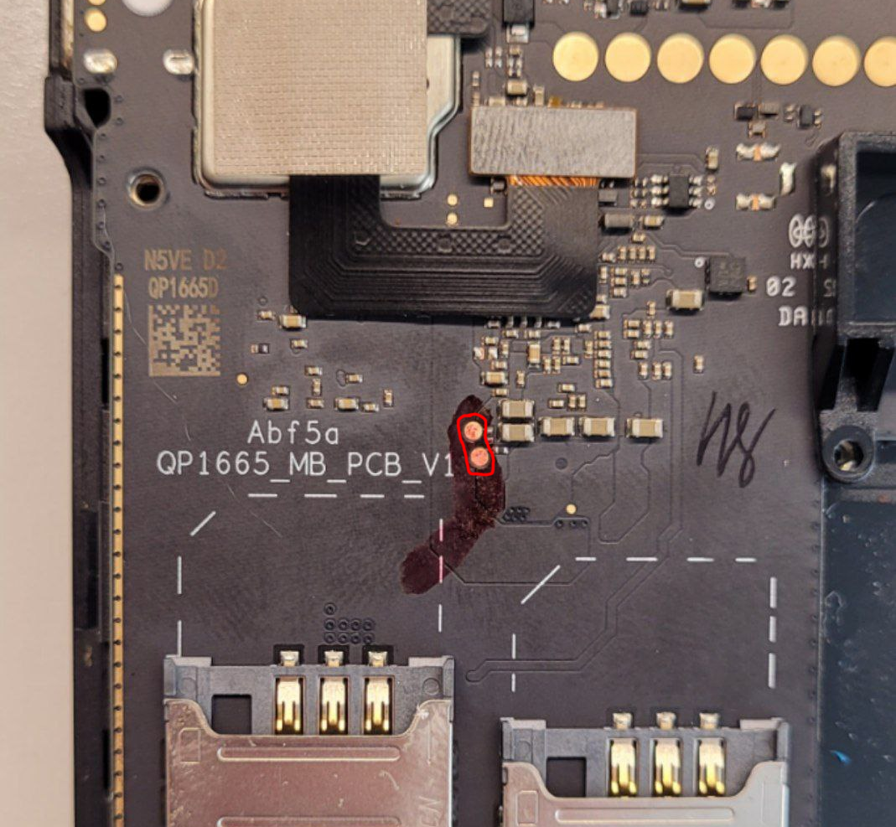
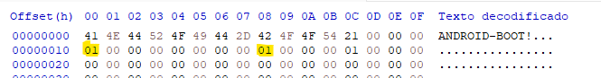
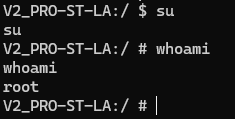

# Rooteo Sunmi V2 Pro

En esta mini guía veremos cómo rootear el Sunmi V2 Pro, equipo basado en el Qualcomm MSM8917 / Snapdragon 425. El proceso es parecido a cualquier rooteo en equipos con micro Qualcomm, con la diferencia de que no tenemos `fastboot` funcional. Esto hace que el desbloqueo del bootloader y backup/flasheo de particiones es un poco más complicado.

Como parte del rooteo se borran todos los datos de userdata, por lo que es necesario backupearla manualmente si tiene datos importantes.

## Elementos necesarios
- [QPST (incluye QFIL) 2.7.496](https://mega.nz/file/MoJAAKIR#U_EF7mtGEtnVWYwXtDcYGjSL-1qgAHgarVjdC9T0J7g) (Sacado del foro Hovatek)
- [Archivo MBN para MSM8917](https://mega.nz/file/9uBThYiK#DM5ZGhaPBwSZREVPPTw_7F27RIGmYe9GPIAJUI4mrWw) Checksum SHA256: 73084AEBDFFD2F33... (Sacado del foro Hovatek)
- [Instalador de Magisk](https://github.com/topjohnwu/Magisk/releases/tag/v27.0)
- Destornillador T8, destornillador PH00 y pinza metálica para unir testpoints

## Pasos para entrar a modo EDL (emergency download mode)
- Apagar el equipo
- Desarmar el equipo. Tiene tornillos traseros y en el compartimiento de la impresora también
- Identificar los testpoints, son los dos marcados con rojo en el medio de la foto
- Con el equipo apagado, tocar ambos testpoints con una pinza de puntas fina metálica, mientras se conecta el cable USB a la computadora
- Si todo funcionó bien, debería reconocerse como un puerto serie (COM) con nombre `Qualcomm HS-USB QDLoader 9008` o similar. Puede que sea necesario instalar drivers si es la primera vez que se realiza el proceso
- Si no se reconoció o encendió normalmente luego de unos segundos, desconectar la terminal, dejar apretado el botón de power para apagarla e intentar nuevamente

## Backupear las particiones devinfo y boot

- Abrir QFIL
- Elegir `Flat Build` y seleccionar el archivo mbn en "Programmer Path"
- Seleccionar el puerto COM correspondiente  
- Ir al menú `Tools` -> `Partition manager`. Luego de unos segundos aparecerá la lista de particiones del sistema
- Elegir la partición `boot`, darle click derecho => `Manage partition data`
	- En la ventana que aparece, presionar `Read data...` , paso que puede durar unos segundos.
- Repetir el mismo proceso con la partición `devinfo`
- Ir a la carpeta `%appdata%/Qualcomm/QFIL/...` y encontrar ambos archivos binarios leidos. El que pesa 1 MB es el de devinfo, el que pesa 64MB es el de boot.
- Realizar un backup de ambos archivos ya que los modificaremos y reflashearemos 
- Renombrarlos a `devinfo.bin` y `boot.bin`
Video mostrando proceso: https://www.youtube.com/watch?v=FBfQLYEVldA

## Modificar el boot usando magisk

- Reiniciar la terminal
- Usando el cable (u otro método) copiar el APK de Magisk y el boot.bin a la terminal, por ejemplo en la carpeta de descargas
- Instalar el APK de magisk. Abrirlo e ir a la parte que dice `Install`, elegir el bin y esperar a que realice su proceso.
- Una vez que termina el proceso, indicará donde creó el bin modificado `magisk_patched-...bin`, por lo general la carpeta de descargas
- Copiar dicho archivo a la computadora
- Ir a los ajustes de la terminal, y validar que dentro de la opción `Developer options` esté habilitado el `OEM unlocking`
- Apagar la terminal

## Modificar el devinfo usando un editor hexadecimal
- Como se observa en la captura de pantalla, es necesario editar el archivo devinfo.bin usando un editor hexadecimal, como el HxD. 
- Modificar el caracter en las posiciones 0x10 y 0x18 para que valgan `01`. 
- En estos bytes se guarda el detalle de si el bootloader está desbloqueado o no, y es necesario modificarlos para que el sistema pueda bootear luego de flashear el boot modificado

**Asegurarse que el tamaño del archivo sigue siendo 1.048.576 bytes. Si no lo es, verificar que el editor hexadecimal esté en modo "sobreescribir", no insertar.**
## Flashear devinfo y boot modificados
- Realizar nuevamente el proceso con el QFIL hasta llegar al `Partition manager`, pero esta vez usar la opción `Load image...` para flashear ambas particiones con los archivos modificados correspondientes
- Reiniciar el equipo, y aparecerá un cartel indicando que el sistema operativo ha sido cambiado. Presionar alguna tecla de volumen para entrar al menú. En el menú, bajar con vol+ y vol- hasta la opción "Reboot to recovery", y luego apretar el botón de power para elegir
- Una vez en recovery, elegir la opción de "Factory reset/erase userdata" y aplicarla
- Reiniciar la terminal
## Final 

Si todo salió bien, debería verse la aplicación de Magisk instalada. Al entrar a la misma probablemente mencione que es necesario reiniciar nuevamente. Seguir esos pasos. 

Si sale todo correctamente, luego del reinicio, al ejecutar el comando `su` desde `adb shell` la misma debería mostrar un cartel pidiendo permisos de superusuario. Si todo salió bien deberíamos ser root

Ahora podemos remontar la partición de system como R/W y editarla a gusto, aunque recomiendo realizar un backup previo por las dudas.